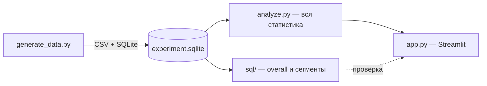

# Express Checkout — A/B

<p align="center">
  
  
  
  
  
</p>

<p align="center">
  <b>Product analytics case · эксперимент</b><br/>
  Катить «Купить сразу» на всех — или только там, где эффект есть<br/>
  <i>Дизайн A/B-теста, проверка валидности, эффект с доверительным интервалом и решение ship / iterate по сегментам.</i>
</p>

<p align="center">
  <b>Решение.</b> Overall CR <b>+9.9%</b> (p = 0.002), но lift почти весь с <b>desktop (+22%)</b>.
  iOS и Android без значимого эффекта. AOV чуть ниже, <b>RPU выше</b> — катим desktop, mobile не усредняем.
</p>

---

## О проекте

**Express Checkout** — второй кейс портфолио для стажировки **product analyst**: A/B-тест кнопки «Купить сразу» на карточке товара против обычного пути «в корзину → чекаут».

Продуктовый вопрос — не «вырос ли CR в среднем», а стоит ли катить фичу всем, если эффект неравномерный по устройствам. Единица рандомизации — пользователь (ITT), 50/50, 14 дней, 42 000 человек. Primary-метрика — conversion, guardrails — AOV и выручка на пользователя (RPU).

```text
┌──────────────────────────────────────────────────────────┐
│              === EXPRESS CHECKOUT A/B ===                 │
│                                                            │
│  SRM · мощность / MDE       CR control vs treatment + CI   │
│  Гетерогенность: device      Новые vs вернувшиеся          │
│  Guardrail: RPU vs AOV       Решение: ship / iterate        │
└──────────────────────────────────────────────────────────┘
```

---

## Стек

| Технология        | Зачем в проекте                                                    |
| ------------------ | --------------------------------------------------------------------- |
| **Python 3.10+**    | генератор назначений и слой статистики                              |
| **SQLite + SQL**    | conversion и RPU запросом — проверка, что цифры не «из головы»       |
| **scipy / statsmodels** | SRM (binomtest), z-test долей, Wilson CI, Welch t-test, MDE и sample size |
| **Streamlit**       | дашборд эксперимента и карточка решения                              |
| **Plotly**          | бары с доверительными интервалами, гетерогенность по сегментам       |

---

## Что нашёл

|     | Проверка                    | Результат                                                              |
| --- | ---------------------------- | -------------------------------------------------------------------------- |
| ✓   | **SRM**                       | p = 0.24 — сплит не сломан, тесту можно верить                            |
| ✓   | **Overall conversion**        | 8.89% → 9.77%, **+9.9%** отн., p = 0.002 — статистически значимо           |
| ✓   | **Desktop**                   | **+22%**, p < 0.001 — эффект реальный                                     |
| ✗   | **iOS / Android**              | −0.8% / −4.1%, не значимо — усреднять с desktop нельзя                    |
| ✓   | **New users**                  | +13% (p = 0.01) — новым 1-click помогает сильнее, чем вернувшимся          |
| ✓   | **Guardrail: RPU**             | AOV −1.3%, но RPU **+16 ₽** — денег на пользователя больше, чек не «съел» выручку |

### Модель данных

```text
assignments
─────────────────────────────────────────
 user_id      уникальный пользователь теста
 variant      control | treatment
 device       desktop | ios | android
 user_type    new | returning
 channel      канал привлечения
 assigned_at  когда попал в тест
 purchased    0 / 1 — купил ли (в знаменателе все назначенные, ITT)
 revenue      сумма покупки, 0 если не купил
```

---

## Архитектура



| Файл               | Ответственность                                                          |
| -------------------- | ----------------------------------------------------------------------------- |
| `src/generate_data.py` | 42 000 назначений: variant, device, user_type, purchased, revenue (seed=24) |
| `src/analyze.py`      | SRM, z-test долей, Wilson CI, Welch t-test по RPU, MDE и sample size          |
| `sql/`                | conversion и RPU по веткам и по device/user_type — проверка Python           |
| `app.py`              | порядок анализа на экране: SRM → primary → сегменты → guardrail → решение   |

**Почему так?** Дашборд не считает статистику сам — только вызывает функции `analyze.py`, чтобы формулы жили в одном проверяемом месте. Порядок блоков на экране — это и есть правильный порядок анализа эксперимента, а не просто вёрстка.

---

## Структура

```text
feature-ab-analysis
├── app.py
├── README.md
├── requirements.txt
├── src
│   ├── generate_data.py
│   └── analyze.py
├── sql
│   ├── 01_overall.sql
│   └── 02_segments.sql
└── data
    ├── assignments.csv
    └── experiment.sqlite
```

---

## Быстрый старт

### 1. Требования

- Python **3.10+**

### 2. Установка

```bash
python3 -m venv .venv && source .venv/bin/activate
pip install -r requirements.txt
```

### 3. Данные

```bash
python src/generate_data.py
```

> Можно пропустить — дашборд и `analyze.py` сгенерируют данные сами, если `experiment.sqlite` ещё нет.

### 4. Запуск

```bash
streamlit run app.py
```

Из корня портфолио:

```bash
streamlit run feature-ab-analysis/app.py
```

---

## Пример вывода

```text
SRM p-value                    0.24    (сплит в порядке)

CR control                    8.89%
CR treatment                  9.77%    (+9.9% отн., p = 0.002)
Δ CR абс.                    +0.88 п.п.  95% CI [+0.32 … +1.44]

Desktop                        +22%    p < 0.001  → ship
Android                       −4.1%    p = 0.53   → не значимо
iOS                           −0.8%    p = 0.89   → не значимо

AOV                            −1.3%
RPU                            +16 ₽   (выручка на назначенного выросла)
```

---

## Ключевые решения в коде

<details>
<summary><b>Почему ITT (intent-to-treat), а не только купившие?</b></summary>

<br/>

В знаменателе — все назначенные в ветку, даже те, кто ничего не купил. Иначе сравнение смещается: 1-click может привлекать «случайных» кликнувших, которые в контроле вообще не дошли бы до чекаута.

```python
p_c = x_c / n_c  # n_c — все назначенные в control, не только купившие
```
</details>

<details>
<summary><b>Почему порог SRM 0.001, а не обычные 0.05?</b></summary>

<br/>

Sample Ratio Mismatch проверяется строже, чем обычная значимость — рандомайзер должен делить трафик близко к 50/50, и ложные тревоги здесь дороже:

```python
pval = stats.binomtest(n_t, n, expected).pvalue
"pass": pval > 0.001
```
</details>

<details>
<summary><b>Почему Wilson CI, а не обычный доверительный интервал по нормали?</b></summary>

<br/>

При конверсии в районе 8–10% и `n` в десятки тысяч Wilson-интервал устойчивее к границам 0 и 1, чем классический normal approximation:

```python
ci_c = proportion_confint(x_c, n_c, alpha=ALPHA, method="wilson")
```
</details>

<details>
<summary><b>Почему смотрим RPU, а не только AOV?</b></summary>

<br/>

AOV считается только по купившим и не видит, что купило больше людей. RPU делится на всех назначенных — так виден настоящий эффект на выручку:

```python
aov_t = t[t > 0].mean()          # только купившие — может ввести в заблуждение
rpu_treatment = t.mean()          # все назначенные, включая нули — реальные деньги на человека
```

Отсюда и вывод: чек чуть просел, а денег на пользователя стало больше — 1-click не «съедает» выручку, а добавляет мелкие покупки.
</details>

<details>
<summary><b>Почему сегменты (device, user_type) заданы заранее, а не подбираются по факту?</b></summary>

<br/>

Срезы зафиксированы в дизайне эксперимента до расчёта, а не выбраны постфактум там, где «получилось красиво» — иначе это p-hacking, а не гетерогенность эффекта.

```python
def segments(df: pd.DataFrame, col: str) -> pd.DataFrame:
    for key, part in df.groupby(col):
        res = two_prop(part)
```
</details>